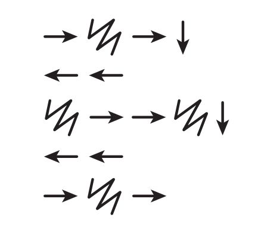

% Code7: Graph Paper Programing
% Gary Dalton
% July 3, 2015

#

<iframe data-autoplay width="800" height="600" allowfullscreen src="http://www.youtube.com/embed/4e3fi_ls8CA"></iframe>

# Objective

-  Understand the difficulty of translating real problems into programs
- Learn that ideas may feel clear to them, and still be misinterpreted by
 a computer
- Realize the need for formal programming structures like loops and functions

# Materials

- Sample Drawings/Algorithms Kit
- Programming Instructions Card
- Large grid graph paper
- Markers, pens, or pencils (two or three colors)

# Vocabulary

## Algorithm

A series of instructions on how to accomplish a task

## Coding

Transforming actions into a symbolic language

## Debugging

Finding and fixing problems in code

## Function

A piece of code that can be called over and over

## Parameters

Extra bits of information that you can pass into a function to customize it

##

- **Algorithm**: A series of instructions on how to accomplish a task
- **Coding**: Transforming actions into a symbolic language
- **Debugging**: Finding and fixing problems in code
- **Function**: A piece of code that can be called over and over
- **Parameters**: Extra bits of information that you can pass into a function

# Review and Extend

## Can you name any of the steps of computational thinking?

##

**Computational Thinking**: A method of problem-solving that helps computer
scientists prepare problems for digital solutions.

- Decompose
- Abstraction
- Patterns
- Algorithm

##

- Can you remember any of the patterns we found among the monsters?
- What else could we describe with the same “abstracted” concepts from the
 monsters?

##

- Could we describe a cow? A bird?
- Would anything have to change to describe a teapot?
- Does a robot really “understand” what people say?

#

# Example

##

## Algorithm words

- move forward, fill-in, move forward, move down
- back, back
- fill-in, move forward, move forward, fill-in, move down
- back, back
- move forward, fill-in, move forward

##

## Find something better?

|  | 

# Repeats

##

Can you think of an easier way to notate _back, back, back_ or _move forward
and fill 5 times_?

##

Look at these “functions.” What do you suppose they do?

## Answers

1. Move forward six spaces
2. Color 6 blocks in a row
3. Color a diagonal line

# Activity

1. Write a program for a medium size image
2. Exchange your program with another coder
3. Draw the image from the program
4. Verify the image with the original coder
5. Repeat steps 1-4 with a large size image

# Wrap up

## Objectives

-  Understand the difficulty of translating real problems into programs
- Learn that ideas may feel clear to them, and still be misinterpreted by
 a computer
- Realize the need for formal programming structures like loops and functions

## Vocabulary

- **Algorithm**: A series of instructions on how to accomplish a task
- **Coding**: Transforming actions into a symbolic language
- **Debugging**: Finding and fixing problems in code
- **Function**: A piece of code that can be called over and over
- **Parameters**: Extra bits of information that you can pass into a function

## Mark Stages 3 and 4 as complete on code.org
