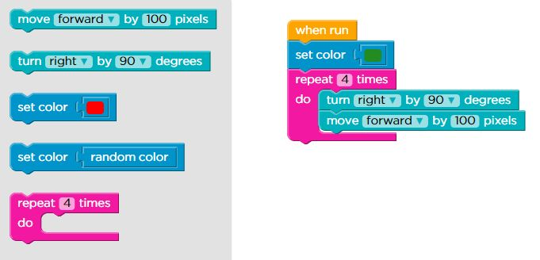
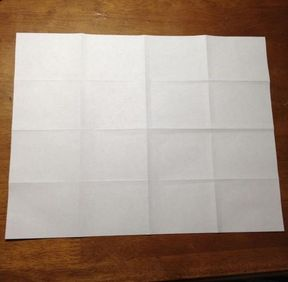

# Functions

##

Using tangram shapes and graph paper will show how important it is to make each instruction as clear and unambiguous as possible.

##

Exploring how many ways paper can be folded into a rectangle shows how some methods can be more efficient than others.

#

<iframe data-autoplay width="800" height="600" allowfullscreen src="https://www.youtube.com/embed/NAViNTHS3LU"></iframe>

# Objective

-  Explain that the same thing can be accomplished many different ways, and
sometimes there are “better” ways than others.
- Practice creating algorithms that describe real-world directions
- Learn to think about solving a problem many different ways
- Think about creating more “efficient” solutions to problems

# Materials

- Tangram Image Pack
- Tangram Pieces
- Graph paper (five or six sheets per pair)
- Two pieces of blank paper

# Vocabulary

## Algorithm

A series of instructions on how to accomplish a task

## Ambiguous

Having more than one meaning

## Efficiency

Having the best outcome for the least amount of work

## Evaluate

To work at an answer

## Hamburger Fold

To fold a paper in half the wide way

## Hot Dog Fold

To fold a paper in half the long way

##

- **Algorithm**: A series of instructions on how to accomplish a task
- **Ambiguous**: Having more than one meaning
- **Efficiency**: Having the best outcome for the least amount of work
- **Evaluate**: To work at an answer
- **Hamburger Fold**: To fold a paper in half the wide way
- **Hot Dog Fold**: To fold a paper in half the long way

# Review and Extend

##

##

- What did the set color block do?
- How would we use what we learned in Stage 5 to make a square with different
colors on all sides?

##

Not only can a computer “misunderstand” what you mean for it to do, but you can tell a computer to do the same thing several different ways.

##

Computers "understand" things differently than we do. Partly, this is because computers can't "guess" what we want based on our tone of voice or our body language. If you tell your friend "Aperture is a hard word. Can you spell that?"" It is very likely that your friend will try to spell "aperture." If your friend is a computer, however, it would probably spell the word "that." If you give an ambiguous instruction, a computer will
evaluate it the way it has been told to, whether it is what you meant or not.

# Tangrams

##

Tangrams are a Chinese geometric puzzle consisting of a square cut into seven pieces that can be arranged to make various other shapes. This won’t require the use of every single piece each time, and we will lay the shapes out on graph paper.

## Algorithms for clarity

1. The *programmer* and the *computer* sit back to back
2. The *programmer* selects a completed picture of shapes
3. The *programmer* uses words and phrases to direct the *computer* to rebuild the original image (sound effects or body movements are not allowed)
4. The *computer* uses the packet of shapes, graph paper and the spoken instructions to build the image

## Algorithms for clarity

5. Compare the images
6. Discuss which instructions worked well and which did not
7. Switch roles and repeat steps 1-6 with a new picture

# Folding Paper

##

## Can you fold  a sheet of paper into 16 equal rectangles?

## Can you find a second way to do it?

## Can you find a third way to do it?

## OK, let's keep track of how to fold and how many folds it takes

- How many ways can you fold the paper?
- How many folds does it take to get to that result?
- What is the highest number of folds that you can make to create 16 rectangles?
- What is the smallest number of folds that you can make to create 16 rectangles?

# Wrap up

## Objectives

-  Explain that the same thing can be accomplished many different ways, and
sometimes there are “better” ways than others.
- Practice creating algorithms that describe real-world directions
- Learn to think about solving a problem many different ways
- Think about creating more “efficient” solutions to problems

## Answer this

- Describe at least 3 different ways to go from the kitchen to your bedroom.
- Why does it matter to be efficient?

## Vocabulary

- **Algorithm**: A series of instructions on how to accomplish a task
- **Ambiguous**: Having more than one meaning
- **Efficiency**: Having the best outcome for the least amount of work
- **Evaluate**: To work at an answer
- **Hamburger Fold**: To fold a paper in half the wide way
- **Hot Dog Fold**: To fold a paper in half the long way

## Mark Stage 6 as complete on code.org
