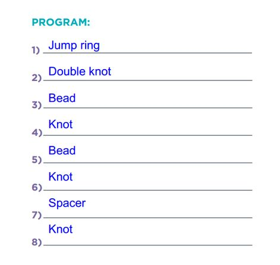

# Functions

Repetitive tasks can be stored in a small group that can be “called” several times, instead of wasting space with lots of copies of the same instruction.

#

<iframe data-autoplay width="800" height="600" allowfullscreen src="https://www.youtube.com/embed/NAViNTHS3LU"></iframe>

# Objective

- Learn to find patterns in processes
- Think about an artistic task in a different way

# Materials

- One foot of string, thread, or fishing line per person
- 2-4 beads per person
- 2-4 other accessories (buttons, hoops, spacers) per person
- One special bead, prism, or sun charm per person
- One Skills Sheet per person

# Vocabulary

## Abstraction

Removing details from a solution so that it can work for many problems

## Function

A piece of code that can be called over and over

## Function Call

The place in your program where you call a function you have defined

## Function Definition

The place where you assign a series of actions to one easy-to remember name

## Program

Instructions that can be understood and followed by a machine

## Variable

A placeholder for a value that can change

##

- **Abstraction**: Removing details from a solution so that it can work for many problems
- **Function**: A piece of code that can be called over and over
- **Function Call**: The place in your program where you call a function you have defined
- **Function Definition**: The place where you assign a series of actions to one easy-to remember name
- **Program**: Instructions that can be understood and followed by a machine
- **Variable**: A placeholder for a value that can change

# Review and Extend

##

In Stage 7, The Artist II, we drew repeating shapes using code blocks

##

- Do you remember what an algorithm is?
- What algorithm might you use to draw a snowman?

# Suncatcher

## How did I make this?

1. First, I put a bead on the string, then I tied a knot. I put another bead on a string, and tied another knot. Then, I put a spacer on the string and tied another knot.
2. After that, I did it all again. I put a bead on the string, then I tied a knot. I put another bead on a string, and tied another knot. Then, I put a spacer on the string and tied another knot.
3. Finally, I put on the special charm, and tied one last knot.

## With rhythm

>"Bead, knot, bead, knot, spacer, knot.

>Bead, knot, bead, knot, spacer, knot.

>Special charm, final knot."

##

##

- How many instructions do we have left to go through?
- How many lines do we have left?
- What should we do?

# Activity

##

- Look at the programming sheet.
- Notice that there are sections labeled Skill 1 and Skill 2.
- Any tasks you place there may be called from the program by writing the skill.

**Questions?**

##

Try to fill in the skills and program to make a working example of the algorithm.

>"Bead, knot, bead, knot, spacer, knot.

>Bead, knot, bead, knot, spacer, knot.

>Special charm, final knot."

## Ok, let's make those suncatchers.

# Wrap up

## Objectives

- What patterns did you find?
- Patterns may be found in art, nature, and code.

## Vocabulary

- **Abstraction**: Removing details from a solution so that it can work for many problems
- **Function**: A piece of code that can be called over and over
- **Function Call**: The place in your program where you call a function you have defined
- **Function Definition**: The place where you assign a series of actions to one easy-to remember name
- **Program**: Instructions that can be understood and followed by a machine
- **Variable**: A placeholder for a value that can change

## Mark Stage 8 as complete on code.org
